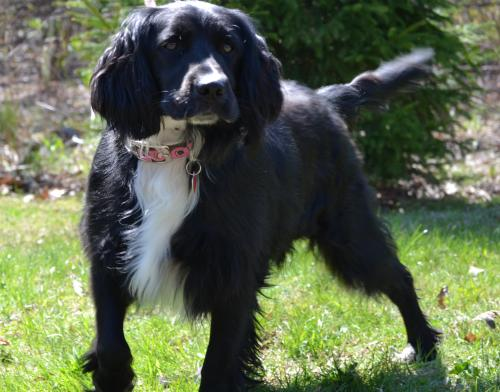
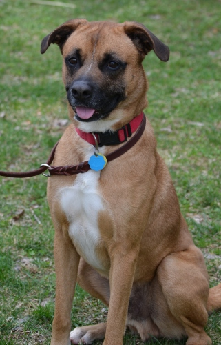
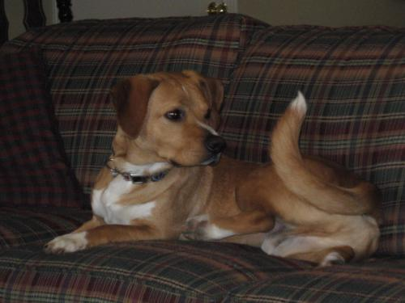
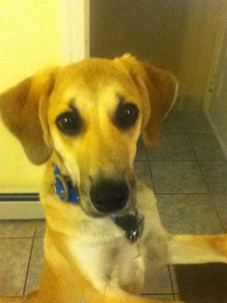

SIMON FOUNDATION
================

INDIA
-----

Kelpie/Chow female. Cute, a little overweight.  Looks like a dark fuzzy heeler. Very kissy, attention driven.  Can calm down easily when asked.  Sits well, can lie down too.  Trainer says she's pretty trainable and smart. Can be vocal with other dogs, but wasn't when she played with Miura (trainer's male shepherd).

Lee: I liked how attention-driven she was, energetic but not hyper/obnoxious.  Liked toys but wasn't obsessed.  Played well, but not too intensely and I was able to get her to come to me during play.

M: Both really excited to see us, and good energy. Licky but not annoying about it. Seems pretty well trained, in response to sit/stay. Short hair, didn't seem to shed much. Would need to be on a diet and have exercise.  Might affect our ability to train with treats. Was a stray from NC. Roughly 3 years old

MAGGIE
------

Spaniel female. Sweet, calm, gets excited by tennis balls, herds them all.  64lbs after heartworm treatment, was 50lbs before. Very nice but more interested in the balls than us at times.  A little on the big side (pretty tall).

Long hair is really pretty.

CAPTAIN
-------

Boxer/shepherd male.  Tall and gangly with big paws and big head but skinny torso. Very sweet, a bit rambunctious at first but calmed down pretty well. Pays attention very nicely when you have a toy or his attention.  High energy and very interested in smells but not too hard to get his attention.  Good sit and down commands.

Played nicely with Miura, but pretty intensely.  It was/would have been hard to distract him from play.

I liked his energy and sweetness.  Seemed stable and controllable, and very smart. Long "boxing" paws.  Need to keep his nails short!

M: Better at responding to training commands than India. Very toy motivated, liked the squeaky toy.  Seemed to have a wide range between quiet and hyper. High energy level was higher than India's, and more movement oriented.  Prettier than India, not to say India wasn't cute. Short hair coat. A bit wiry/greasier in a way that I could be allergic too.  Maybe a bit more shedding than India. Very affection motivated.

PACK LEADERS
============
Situation was very different from Simon.  Lots of dogs around, the dogs have been living in an open environment with all the dogs together and with several other visitors today.  Both dogs were calmer and less focused on us, but surrounded by a lot more distractions than the small room at Simon.

M: Obviously both will be fine around other dogs, well socialized

HAPPY
-----

Corgi/hound/boxer male two-three years. Very calm and chill. Responsive but not terribly attentive.  Affectionate when wanted, but pretty aloof otherwise. Not vocal, interacted well with other dogs, which it knew. Not much of a personal connection, even when doing some training/praise exercises.  More food responsive than praise/attention.

M: Seemed like an older dog, in his temperament. Always seems chilled out but probably still needs a lot of exercise. Not a couch potato, despite the ad. Short and very long. Could reach counter. Trainable. Very pretty.

MARLEE
------

Thin small lab male, 9 months. Very sweet and energetic, but not hyper.  Much more affectionate than Happy, seemed to connect personally with me, unlike Happy. Very sweet, smart, cute and energetic. Responds well to attention, but not too attached (of course, more distractions at the house than simon).

M: Very young, will probably gain 10--15 pounds (currently 31 lbs). Super energetic, but pretty able to self-entertain.  Hard to evaluate it but he did wander around the room. Lanky, tall. Could reach counter.  Food responsive, but also very praise responsive.  looked at lee's face instead of for the treat.

