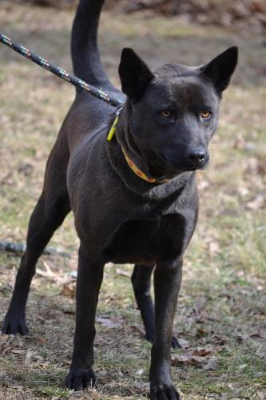

SIMON FOUNDATION
================

INDIA
-----

> India is a remarkable young kelpie mix.  Her black coat and intense gold eyes
> are striking.  She is shy at first introduction but warms up quickly when she
> gets to know you.  India is looking for her forever family.  If you are
> interested in sharing your life with this beautiful girl, submit an
> application to adopt on our website:  thesimonfoundation.org

Kelpie/Chow female. Cute, a little overweight.  Looks like a dark fuzzy heeler. Very kissy, attention driven.  Can calm down easily when asked.  Sits well, can lie down too.  Trainer says she's pretty trainable and smart. Can be vocal with other dogs, but wasn't when she played with Miura (trainer's male shepherd).

Lee: I liked how attention-driven she was, energetic but not hyper/obnoxious.  Liked toys but wasn't obsessed.  Played well, but not too intensely and I was able to get her to come to me during play.

M: Both really excited to see us, and good energy. Licky but not annoying about it. Seems pretty well trained, in response to sit/stay. Short hair, didn't seem to shed much. Would need to be on a diet and have exercise.  Might affect our ability to train with treats. Was a stray from NC. Roughly 3 years old

<!--
MAGGIE
-----

Spaniel female. Sweet, calm, gets excited by tennis balls, herds them all.  64lbs after heartworm treatment, was 50lbs before. Very nice but more interested in the balls than us at times.  A little on the big side (pretty tall).

Long hair is really pretty.
-->

CAPTAIN
-------

> Wonderful young boxer mix is looking for an active family to call his own.
> Captain is great with other dogs, and cats are okay too.  He has some basic
> obedience and will gladly give you his paw, if you will only give him some
> well deserved attention.  If you would like to meet Captain, please submit an
> application on our website:  thesimonfoundation.org

Boxer/shepherd male.  Tall and gangly with big paws and big head but skinny torso. Very sweet, a bit rambunctious at first but calmed down pretty well. Pays attention very nicely when you have a toy or his attention.  High energy and very interested in smells but not too hard to get his attention.  Good sit and down commands.

Played nicely with Miura, but pretty intensely.  It was/would have been hard to distract him from play.

I liked his energy and sweetness.  Seemed stable and controllable, and very smart. Long "boxing" paws.  Need to keep his nails short!

M: Better at responding to training commands than India. Very toy motivated, liked the squeaky toy.  Seemed to have a wide range between quiet and hyper. High energy level was higher than India's, and more movement oriented.  Prettier than India, not to say India wasn't cute. Short hair coat. A bit wiry/greasier in a way that I could be allergic too.  Maybe a bit more shedding than India. Very affection motivated.

PACK LEADERS
============
Situation was very different from Simon.  Lots of dogs around, the dogs have been living in an open environment with all the dogs together and with several other visitors today.  Both dogs were calmer and less focused on us, but surrounded by a lot more distractions than the small room at Simon.

M: Obviously both will be fine around other dogs, well socialized

<!--
HAPPY
-----

> Happy is a beautiful sweet boy. He is 3 years old. He loves children and is
> good with other dogs. He is hw neg, fully vetted and neutered , Happy is a
> loving boy and wants to find a home that he can relax and sit on the couch.

Corgi/hound/boxer male two-three years. Very calm and chill. Responsive but not terribly attentive.  Affectionate when wanted, but pretty aloof otherwise. Not vocal, interacted well with other dogs, which it knew. Not much of a personal connection, even when doing some training/praise exercises.  More food responsive than praise/attention.

M: Seemed like an older dog, in his temperament. Always seems chilled out but probably still needs a lot of exercise. Not a couch potato, despite the ad. Short and very long. Could reach counter. Trainable. Very pretty.
-->

MARLEE
------

> Marley is an awesome 8 month old lab mix. He is fully vetted, housetrained
> and neutered. He is so wonderful with children and other dogs. Please fill
> out an application on our website at www.packleadersrescue.com

Thin small lab male, 9 months. Very sweet and energetic, but not hyper.  Much more affectionate than Happy, seemed to connect personally with me, unlike Happy. Very sweet, smart, cute and energetic. Responds well to attention, but not too attached (of course, more distractions at the house than simon).

M: Very young, will probably gain 10--15 pounds (currently 31 lbs). Super energetic, but pretty able to self-entertain.  Hard to evaluate it but he did wander around the room. Lanky, tall. Could reach counter.  Food responsive, but also very praise responsive.  looked at lee's face instead of for the treat.

SWEETPEA Friends of Rutland Animals
===================================
Somewhat less organized place, not nearly as nice as Simon, not very homey like Pack Leaders.  Didn't actually seem to put that much of an effort into training/assessing the dogs.

We met the dogs outside, on our own, on leash.  Yet another situation different from Simon/Pack Leaders.  Dogs had some distractions, but also less after they were used to being outside.

Knight
------

Shepherd/Setter/Retriever (Chow?) male, about 1 year.

> KNIGHT is neutered and just a year old. He should be the only dog in a
> household, as he is rambunctious with other dogs. Lots of energy since he is
> young. Very intellegent, fun, loving dog. Our guess is he is a German
> Shepherd mixed with English Setter  or Retriever.  Come visit and help us
> work it out! He may steal your heart too!

Sad life history. Been in and out of several shelters and foster homes. Mixed reasons for surrender. One place said that he was getting beat up by the other 2 dogs in the home. Another place said he was food aggressive with the other dogs. Another place said he was chasing cats. Another place said that he was being handled too roughly by the owners. So, either is afraid of other dogs or aggressive towards them, it's not clear which. The shelter manager didn't know and we did not have the opportunity to test it out. We did see him barkig and wanting to go to a dog that was brought outside. He also growled at a dog he could barely see out of the window while we were in the waiting room, which was disconcerting. 

He was very distracted by the other dogs and any other people he saw while we had him out. When we got him out of view of all that, he calmed down a lot. He was really sweet. He jumped a little but not excessively so and seemed responsive to requests to knock it off. His responsiveness to commands was in the absence of food rewards so that is promising.

Other pertinent history is that he is a picky eater. The shelter manager said that he likes to have warm food mixed in with his kibble. He was also uninterested in a milk bone type treat we tried to give him.

Kalli
-----

Bluetick Coonhound / Heeler Female, roughly 2 years.

She seemed to like Maritza more than Lee, or else be more nervous around Lee. But, sometimes she just went to whoever wasn't holding the leash. She would come over and totally bury her head in your lap and seemed to not want to look up. Very shy. She tried to kiss/play with Maritza a bit but since Maritza doesn't actually know how to play with dogs in that way it's hard to assess. She was a little mouthy but it didn't really frighten Maritza. Her tameness and lack of confidence actually made Maritza feel a little bit more confident about training and commands. 

A sweet hound dog she was super interested in sniffing around and if there was something to sniff she was much less attentive. She sort of had an on/off switch in that way. She would either be totally focused on us or totally disinterested. In contrast to India, it was hard to get her attention back from a distracting item without removing the distracting item.

She didn't bark at all or yowl while we had her or when we saw her in the kennel. She is definitely a hound dog, so it's very hard to say whether this would continue at home or if she would become a barker. 

<!--
Quaker
-----

Treeing Walker Coonhound Male, roughly 1 year
-->

